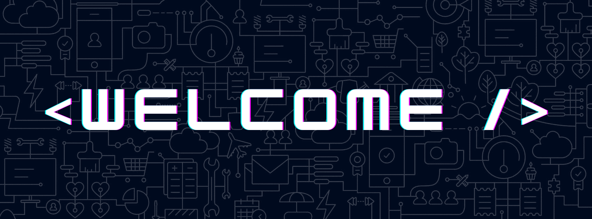

# .alert("Hello World") 👋

### About Me

My name is Brian Bozigian and i'm a full-stack web developer who loves to learn new languages, whether its human or machine 🤖 

I enjoy the outdoors and love experiencing new things. The main things I like to do in my free time are hiking 🥾, gaming 🎮, and watching wrestling 💪 

 Growing up, I've always loved problem-solving and tinkering with things to figure out how they worked. It is safe to say that I never grew out of that, which led to becoming a full-stack web developer. 

 I think it is important to always want to learn more things, since life is always teaching us new things. 🌱  

### 💻 Languages 

 

 

 

### Tools and Libraries

### ⚙️ Github Stats

###  Get in touch 📬 
- LinkedIn - <a href="https://www.linkedin.com/in/brian-bozigian/">Linkedin</a>
- Email - <bbozigian@outlook.com>
